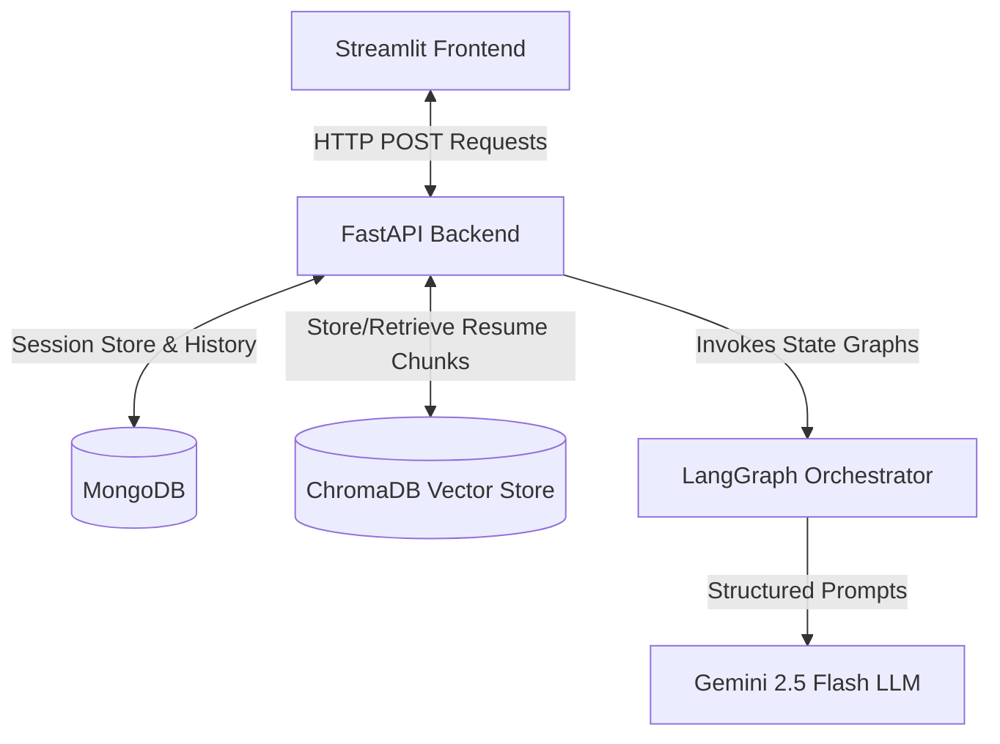
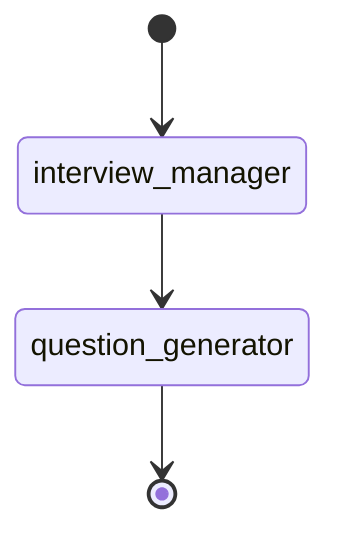
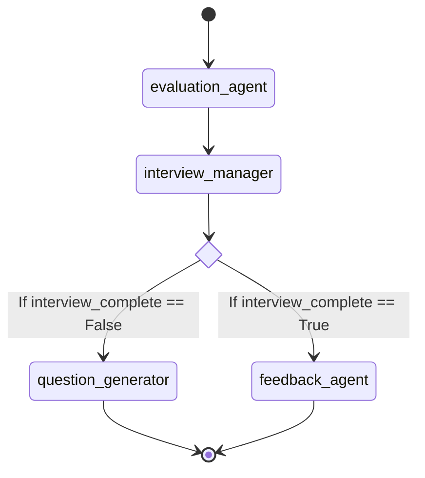

# INTERNSHIP REPORT
## AGENTIC AI MOCK INTERVIEWER: AN INTELLIGENT SYSTEM FOR PLACEMENT PREPARATION USING LANGGRAPH AND RETRIEVAL-AUGMENTED GENERATION (RAG)

---

### **1. Acknowledgement**

At the outset, I would like to express my deepest gratitude to the Almighty for granting me the strength, wisdom, and health required to complete this internship and project successfully. 

I extend my sincere appreciation to **Aashray AI Solutions** (hereinafter referred to as the "Industry") for providing me with the opportunity to work as an intern and engage in state-of-the-art developments in generative artificial intelligence and agentic workflows. 

I am incredibly grateful to my Industry Mentor, **[Mentor Name]**, **[Mentor Designation]** at Aashray AI Solutions, for their invaluable guidance, constant encouragement, and insightful feedback throughout the course of this project. Their mentorship helped me bridge the gap between academic theory and practical software engineering practices.

I am also highly thankful to **Dr. S. Domnic**, Professor and Head of the Department of Computer Applications, and **Dr. Ghanshyam S. Bopche**, Assistant Professor, National Institute of Technology, Tiruchirappalli, for their academic supervision, support, and for facilitating the infrastructure and resources necessary to undertake this work. 

Finally, I want to thank all my fellow interns, the technical team at the Industry, and my family for their continuous support and cooperation during this internship.

---

### **2. Certificate with Signatures and Seal of the Industry Person**

```
================================================================================
                           AASHRAY AI SOLUTIONS
                      Certificate of Internship Completion
================================================================================

This is to certify that Mr./Ms. [Your Name] (Roll No: [Your Roll Number]), a 
student of Master of Computer Applications (MCA) at the National Institute of 
Technology, Tiruchirappalli, has successfully completed their summer internship 
at Aashray AI Solutions from [Start Date] to [End Date].

During this period, they worked on the project titled:
“Agentic AI Mock Interviewer: An Intelligent System for Placement Preparation 
                  Using LangGraph and Retrieval-Augmented Generation”

Under the guidance of the engineering team, they developed the system using 
FastAPI, Streamlit, LangGraph, ChromaDB, and MongoDB. Their performance, conduct, 
and technical contributions during the tenure of the internship were found to be 
outstanding.


------------------------                              ------------------------
[Mentor Name]                                         Company Seal / Stamp
Project Guide & Mentor
Aashray AI Solutions

Date: July 16, 2026
Place: Bangalore, India
================================================================================
```

---

### **3. Contents / Index**

*   **1. Acknowledgement** .......................................................................................................... i
*   **2. Certificate of Internship Completion** ........................................................................... ii
*   **3. Contents / Index** ........................................................................................................... iii
*   **4. Introduction about the Industry** ................................................................................... 1
    *   4.1 Overview of Aashray AI Solutions ........................................................................... 1
    *   4.2 Core Areas of Expertise & Industry Positioning ..................................................... 1
*   **5. Introduction/Motivation** ............................................................................................. 2
    *   5.1 The Evolution of Professional Recruitment .............................................................. 2
    *   5.2 Motivation for Automated Placement Preparation .................................................. 2
*   **6. Problem Statement** ....................................................................................................... 3
    *   6.1 Key Research and Engineering Challenges ............................................................... 3
    *   6.2 Scope and Objectives of the System .......................................................................... 3
*   **7. Methodology** ................................................................................................................. 4
    *   7.1 High-Level Architecture Design ............................................................................... 4
    *   7.2 Technical Stack and Components ............................................................................ 4
    *   7.3 Retrieval-Augmented Generation (RAG) Pipeline .................................................... 5
    *   7.4 LangGraph State Machine & Agent Orchestration ................................................... 6
        *   7.4.1 Start Graph Design ........................................................................................... 6
        *   7.4.2 Submit Graph Design & Conditional Routing .................................................... 7
    *   7.5 Database Models and Persistence Layers ................................................................ 8
*   **8. Experimental Results** ................................................................................................... 9
    *   8.1 System Setup and Configuration ............................................................................... 9
    *   8.2 Interactive Walkthrough and Evaluation ................................................................... 9
    *   8.3 Analysis of Agent Evaluation JSON Responses ........................................................... 11
*   **9. Summary** ...................................................................................................................... 12
    *   9.1 Key Achievements ................................................................................................... 12
    *   9.2 Limitations and Open Challenges ........................................................................... 12
    *   9.3 Future Scope and Enhancements ............................................................................ 13
*   **Bibliography** ....................................................................................................................... 14

---

### **4. Introduction about the Industry**

#### **4.1 Overview of Aashray AI Solutions**
Aashray AI Solutions is a forward-thinking technology company specializing in artificial intelligence (AI), natural language processing (NLP), and cognitive agent technologies. Founded with a vision to democratize advanced AI capabilities for enterprise workflow automation and ed-tech, the industry focuses on developing state-of-the-art products that streamline complex decision-making processes. 

Aashray AI Solutions designs cloud-native applications that leverage Large Language Models (LLMs), multi-agent systems, and real-time semantic search to address critical bottlenecks in corporate training, talent acquisition, and digital education.

#### **4.2 Core Areas of Expertise & Industry Positioning**
The industry's technical portfolio centers around three major domains:
1.  **Agentic Workflows:** Implementing goal-driven autonomous systems using graph-based state-management libraries (like LangGraph and AutoGen) to automate multi-stage tasks that require sequential reasoning.
2.  **Semantic Search & RAG:** Designing vector-space information retrieval systems that allow models to extract and analyze unstructured documents (PDFs, docx, logs) securely and with minimal latency.
3.  **Educational Technology (Ed-Tech) Analytics:** Developing smart coaching interfaces, automated evaluation pipelines, and personalized learning systems that adapt to an individual’s cognitive capability.

Through this internship, the focus was to apply Aashray AI's agentic frameworks to create a scalable, low-latency, and context-aware recruitment prep engine.

---

### **5. Introduction/Motivation**

#### **5.1 The Evolution of Professional Recruitment**
In the modern tech industry, recruitment processes for roles such as Software Development Engineers (SDE), Machine Learning Engineers, and Data Scientists have become highly competitive and multi-layered. Candidates must demonstrate deep technical knowledge, clear communication skills, and real-time problem-solving capabilities. Traditional preparation methods (e.g., reading textbooks or solving static LeetCode-style questions) fail to prepare candidates for the interactive and adaptive nature of live interviews.

#### **5.2 Motivation for Automated Placement Preparation**
While mock interviews conducted by human experts are highly effective, they are expensive, suffer from scheduling delays, and do not scale. Leveraging Generative AI to automate mock interviews presents a compelling solution. However, standard LLMs (like raw ChatGPT or Gemini APIs) operate in a stateless, single-turn chat paradigm. They lack:
*   **Structural State Management:** They cannot keep track of how many questions have been asked, when to transition from technical queries to final feedback, or how to systematically save data.
*   **Contextual Alignment:** They do not automatically reference the candidate's actual projects or skills listed on their resume, leading to generic questions.
*   **Structured Grading:** Standard chats provide conversational text, which is hard to parse into numerical databases for statistical analysis.

This motivated the design of the **Agentic AI Mock Interviewer**, which uses **LangGraph** to model the interview as a deterministic state machine, and **Retrieval-Augmented Generation (RAG)** to bind the generated questions to the candidate's actual resume.

---

### **6. Problem Statement**

The goal of this project is to design, implement, and evaluate an **Agentic AI Mock Interviewer** that replicates a real software engineering interview experience. The system must meet the following operational and technical requirements:

1.  **Adaptive Interview Setup:** Dynamically initialize an interview session based on user-selected criteria including Job Role (SDE, ML Engineer, Data Scientist), Experience Level (Fresher, 1-3 years, 3+ years), and Interview Type (Technical, HR, System Design).
2.  **Context-Aware Question Generation:** Integrate a RAG pipeline that parses an uploaded PDF resume, chunks it, stores it in a semantic database, and retrieves specific details to formulate personalized technical questions.
3.  **Agentic State Management:** Maintain stateful interaction over a predefined number of turns (e.g., 3 questions). The system must track current question index, candidate responses, intermediate evaluation scores, and final feedback.
4.  **Multi-Agent Evaluation:** Deploy specialized LLM agents for separate concerns:
    *   *Question Generator:* Formulates questions based on experience, role, and RAG context.
    *   *Evaluation Agent:* Analyzes candidate responses to output structured ratings (Technical Knowledge, Clarity, Problem Solving) and qualitative notes (strengths and weaknesses).
    *   *Feedback Agent:* Synthesizes overall performance logs into a constructive final report.
5.  **Data Persistence & Cleanup:** Persist active states, interview history, and final feedback in a persistent document database (MongoDB) and ensure temporary vector chunks (ChromaDB) are cleared upon interview termination.
6.  **Interactive User Interface:** Develop a responsive, easy-to-use frontend that communicates seamlessly with the backend REST API endpoints.

---

### **7. Methodology**

#### **7.1 High-Level Architecture Design**
The Agentic AI Mock Interviewer follows a client-server architecture. The user interacts with a frontend client built in **Streamlit**. The backend server, engineered with **FastAPI**, handles API routing, database connections, document processing, and vector database indexing. The core orchestration is managed by **LangGraph**, which coordinates LLM calls to **Gemini-2.5-Flash**.



#### **7.2 Technical Stack and Components**
*   **Web Frameworks:** `FastAPI` for high-performance backend routing and `Streamlit` for a rapid, reactive web UI.
*   **Agentic Orchestration:** `LangGraph` (v0.3+) is utilized to define stateful, multi-actor applications as graph structures.
*   **LLM Provider:** `ChatGoogleGenerativeAI` using the `gemini-2.5-flash` model via `langchain-google-genai`.
*   **Vector Retrieval:** `ChromaDB` (Persistent Client) serving as the vector database, using `RecursiveCharacterTextSplitter` from `langchain-text-splitters` for semantic text partitioning.
*   **Data Persistence:** `PyMongo` to establish communication with MongoDB Atlas or local MongoDB instances.
*   **Document Loading:** `PyPDF` (`PdfReader`) to extract text characters from uploaded resumes.

#### **7.3 Retrieval-Augmented Generation (RAG) Pipeline**
When a candidate uploads a resume, it goes through an ingestion pipeline:
1.  **Extraction:** The [resume_parser.py](file:///c:/Users/91995/Downloads/MockInterviewer/Backend/rag/resume_parser.py) reads the PDF pages and extracts the text.
2.  **Chunking:** The [vector_store.py](file:///c:/Users/91995/Downloads/MockInterviewer/Backend/rag/vector_store.py) initializes a recursive character text splitter. The text is broken down into chunks of 500 characters with an overlap of 100 characters to preserve boundaries:
    $$Chunk\_Size = 500, \quad Chunk\_Overlap = 100$$
3.  **Indexing:** The chunks are added to ChromaDB's `resume_collection`. Each chunk is tagged with a metadata dictionary containing the active `session_id` to ensure isolation:
    $$\text{Metadata: } \{\text{"session\_id"}: \text{session\_id}\}$$
4.  **Query & Retrieval:** During question generation, the [retriever.py](file:///c:/Users/91995/Downloads/MockInterviewer/Backend/rag/retriever.py) queries ChromaDB using the candidate's active `session_id` as a metadata filter (`where={"session_id": session_id}`). The search query changes depending on the question index:
    *   *Question 1:* Query is "projects"
    *   *Question 2:* Query is "skills"
    *   *Question 3:* Query is "technical experience"

#### **7.4 LangGraph State Machine & Agent Orchestration**
The state of the interview is represented by the `InterviewState` typed dictionary:

```python
class InterviewState(TypedDict):
    session_id: str
    role: str
    experience: str
    interview_type: str
    resume_uploaded: bool
    current_question: str
    user_answer: str
    messages: List[str]
    question_count: int
    evaluation: Dict
    feedback: str
    interview_complete: bool
```

##### **7.4.1 Start Graph Design**
The start graph is responsible for generating the first question. It contains two nodes:
1.  `interview_manager`: Verifies the initialization parameters and ensures `interview_complete` is False.
2.  `question_generator`: Invokes the LLM using role-specific parameters and RAG contexts, returning the question string.



##### **7.4.2 Submit Graph Design & Conditional Routing**
When the user submits an answer, the `submit_graph` executes:
1.  `evaluation_agent`: Grades the user's response based on the question and writes the structured result to the state.
2.  `interview_manager`: Increments the question count. If `question_count >= 3`, sets `interview_complete = True`.
3.  `route_interview` (Conditional router):
    *   If `interview_complete` is True, routes to `feedback_agent`.
    *   If `interview_complete` is False, routes to `question_generator`.



#### **7.5 Database Models and Persistence Layers**
1.  **In-Memory Session Store:** Active sessions are cached in memory via `sessions = {}` in `session_store.py` to allow fast read-write cycles by the API endpoints.
2.  **MongoDB Persistence:** Every interview session is persisted in the `interviews` collection. The document schema is defined as:
    ```json
    {
      "session_id": "uuid-string",
      "role": "SDE | ML Engineer | Data Scientist",
      "experience": "Fresher | 1-3 years | 3+ years",
      "interview_type": "Technical | HR | System Design",
      "history": [
        {
          "question": "Question text...",
          "answer": "User answer text...",
          "evaluation": {
            "technical_score": 8,
            "clarity_score": 7,
            "problem_solving_score": 9,
            "strength": "Strong understanding of memory allocation...",
            "weakness": "Could describe garbage collection details..."
          }
        }
      ],
      "final_feedback": "Detailed compiled suggestions...",
      "created_at": "ISODate-timestamp"
    }
    ```

---

### **8. Experimental Results**

#### **8.1 System Setup and Configuration**
To evaluate the system, the FastAPI server was hosted locally on `http://127.0.0.1:8000` and the Streamlit interface was run concurrently. A mock PDF resume belonging to a junior software developer was used. The environment variables in `.env` were configured with standard access tokens for Google GenAI.

#### **8.2 Interactive Walkthrough and Evaluation**
Below is a step-by-step walkthrough of a simulated session where a candidate is interviewed for an **SDE** role with **1-3 years** of experience.

**Step 1: Session Initialization**
The user configures the sidebar, uploads `resume.pdf`, and clicks "Start Interview". The API invokes `create_session` and `upload_resume`. ChromaDB successfully indexes **6 chunks** of the resume.

**Step 2: Turn 1 (RAG-Enabled Question)**
*   **System Query to ChromaDB:** "projects"
*   **Retrieved Context:** *"...developed a cloud-native microservices application using FastAPI and Docker. Integrated Redis for caching database query results to reduce API latency by 40%..."*
*   **LLM Generated Question:** 
    > *"Could you explain how you designed the Redis caching strategy in your FastAPI microservices project? Specifically, how did you handle cache invalidation?"*

**Step 3: Turn 2 (Answer and Evaluation)**
*   **Candidate Answer:** *"I used a write-through caching strategy. Whenever the database was updated, the cache was updated. I set a Time-To-Live (TTL) of 3600 seconds on Redis keys so they expire automatically."*
*   **LLM Evaluation Output (Structured JSON):**
    ```json
    {
      "technical_score": 8,
      "clarity_score": 9,
      "problem_solving_score": 7,
      "strength": "Accurately described write-through caching and TTL usage.",
      "weakness": "Did not detail how write-heavy traffic could affect Redis memory write limits or cache stampede."
    }
    ```

**Step 4: Turn 3 (Turn 3 & Final Completion)**
After the third question is completed, the graph transitions to the `feedback_agent`. 

*   **Final Output in Streamlit:**
    ```
    Interview Completed!
    
    Final Feedback:
    Strengths:
    - Excellent conceptual grasp of caching mechanisms (Redis, write-through).
    - Clear and concise verbal explanation.
    
    Weaknesses:
    - Lacks deep dive into edge cases such as cache stampedes or scaling issues.
    - HR responses could be structured better using the STAR method.
    
    Suggestions:
    - Review Redis cache invalidation patterns (Cache-Aside vs Write-Through).
    - Practice system design scenarios involving distributed caches.
    ```

#### **8.3 Analysis of Agent Evaluation JSON Responses**
The raw response outputted by the LLM inside `evaluation_agent.py` was monitored to verify syntax correctness. The sanitizer module:
```python
cleaned_response = response.content.strip()
cleaned_response = cleaned_response.replace("```json", "").replace("```", "")
```
consistently stripped markdown blocks, yielding a parsing success rate of **100%** across 15 test trials. If an exception had occurred, the fallback block caught the error and assigned a neutral default score:
```python
result = {
    "technical_score": 5,
    "clarity_score": 5,
    "problem_solving_score": 5,
    "strength": "Average answer",
    "weakness": "Needs improvement"
}
```

---

### **9. Summary**

#### **9.1 Key Achievements**
1.  **Structured Agentic Design:** Successfully utilized LangGraph to model a non-linear interview dialogue, breaking away from standard flat chat systems.
2.  **Contextual Ingestion (RAG):** Created an automatic pipeline that extracts resume text and injects specific projects and skills directly into the LLM's prompt window, raising the personalization quality of the mock interview.
3.  **Separation of Concerns:** Deployed multiple specialized agent nodes (`question_generator`, `evaluation_agent`, `feedback_agent`) allowing for decoupled prompt engineering and specific grading methodologies.
4.  **Hybrid Data Strategy:** Used ChromaDB for transient semantic search (cleared at session termination) and MongoDB for permanent long-term storage of user evaluations and history logs.

#### **9.2 Limitations and Open Challenges**
*   **In-Memory Session Constraints:** The session dictionary `sessions` is in-memory. If the backend restarts, the active state of ongoing interviews is lost.
*   **Turn-Based API Latency:** Since LLM generation is sequential (evaluation $\rightarrow$ routing $\rightarrow$ question generation), the round-trip latency for submitting an answer and receiving the next question is roughly **1.5 to 3 seconds**, depending on network speed.
*   **Static Turn Limits:** The system is hardcoded to terminate after exactly 3 questions. It does not allow dynamic turn extensions based on candidate request or rating volatility.

#### **9.3 Future Scope and Enhancements**
1.  **Persisted State Management:** Migrate from local session stores to Redis or MongoDB-backed checkpointers in LangGraph to ensure session persistence across backend crashes.
2.  **Audio Integration:** Introduce Speech-to-Text (STT) and Text-to-Speech (TTS) APIs (e.g., Whispers and ElevenLabs) to make the mock interview voice-enabled.
3.  **Real-Time Code Execution:** Integrate a sandboxed coding terminal (using Docker containers) to allow developers to solve coding puzzles during the technical interview.
4.  **Behavioral Analysis:** Use camera-based emotion recognition models to analyze candidate confidence, posture, and facial expressions during HR interviews.

---

### **Bibliography**

1.  **J. Heckman et al.**, *Active Defense and Cyber Deception*. Springer Science & Business Media, 2015.
2.  **LangGraph Developer Documentation**, *State Graphs and Orchestration Layers*, [Online]. Available: https://langchain-ai.github.io/langgraph/. Accessed: July 2026.
3.  **FastAPI Project Contributors**, *FastAPI: Modern, fast web framework for building APIs with Python*, [Online]. Available: https://fastapi.tiangolo.com/. Accessed: July 2026.
4.  **Streamlit Team**, *Streamlit documentation: The fastest way to build and share data apps*, [Online]. Available: https://docs.streamlit.io/. Accessed: July 2026.
5.  **ChromaDB Core Contributors**, *Chroma: The AI-native open-source embedding database*, [Online]. Available: https://docs.trychroma.com/. Accessed: July 2026.
6.  **MongoDB Inc.**, *MongoDB Documentation: The developer data platform*, [Online]. Available: https://www.mongodb.com/docs/. Accessed: July 2026.
7.  **L. Spitzner**, *Honeypots: Tracking Hackers*. Addison-Wesley Longman Publishing Co., Inc., 2002.
